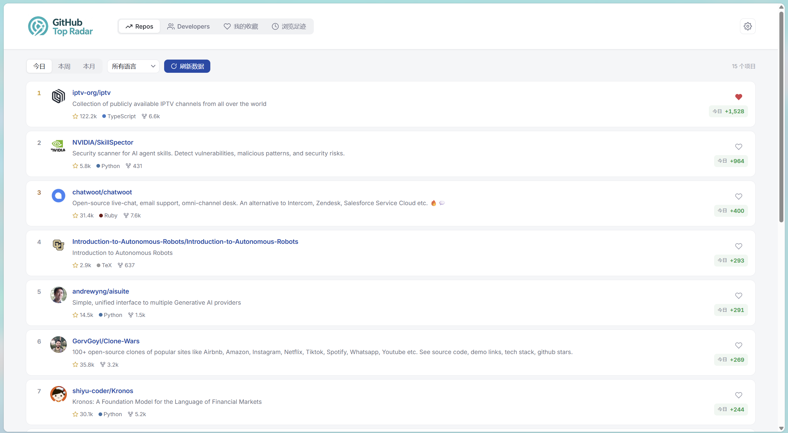
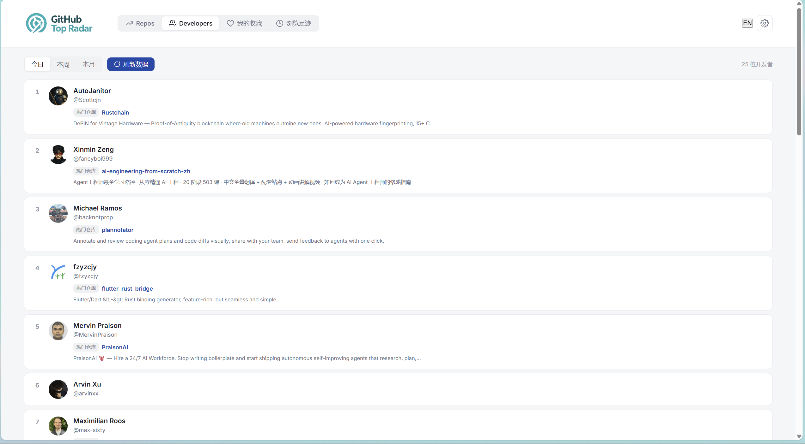
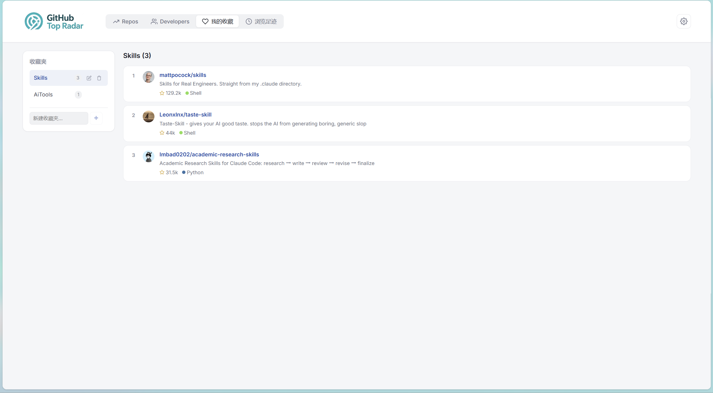
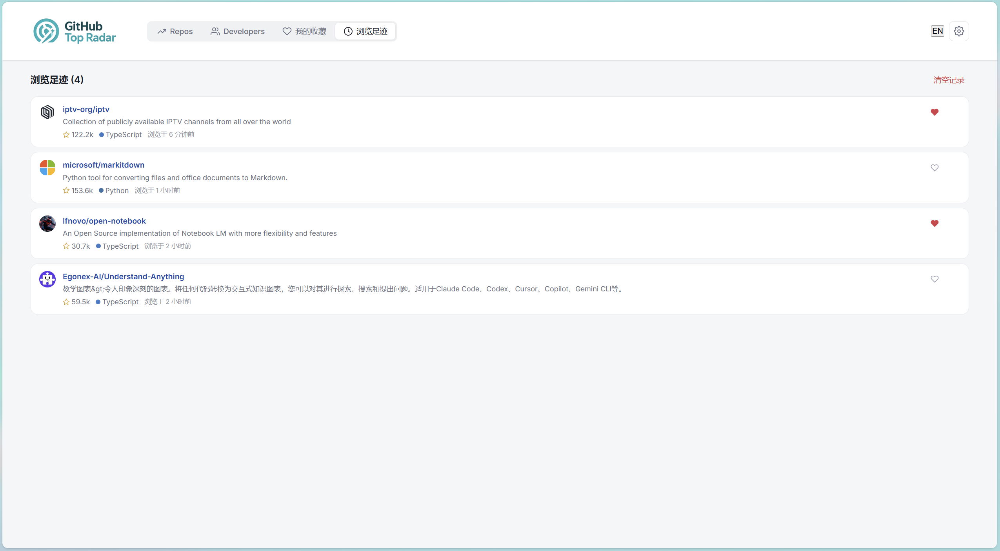
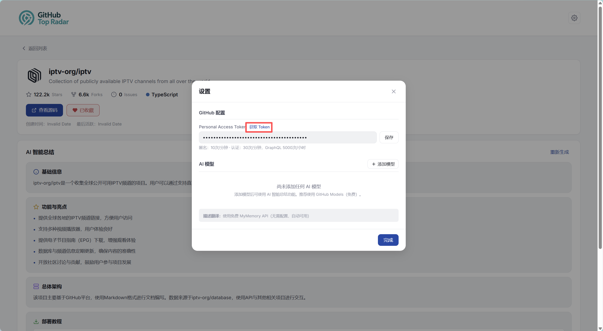

# GitHub Top Radar

> **Discover rising open-source projects and developers on GitHub, with AI-powered insights.**
>
> 发现 GitHub 上正在崛起的开源项目与开发者，AI 助你洞察趋势。

[](./LICENSE)
[](https://react.dev)
[](https://vitejs.dev)
[](https://www.typescriptlang.org)
[](https://www.electronjs.org)
[](./CONTRIBUTING.md)
[](https://github.com/yourname/github-top-radar)

---

## ✨ Features

| | |
|---|---|
| 🔥 **Trending Repos** | Daily / weekly / monthly trending repositories across 30+ languages, scraped straight from GitHub Trending. |
| 👥 **Trending Developers** | Discover fast-growing developers with their popular repositories. |
| 🤖 **AI Structured Summary** | One click to convert any README into 5 structured cards — *Overview · Features · Architecture · Deployment · Use Cases*. |
| 🌍 **Bilingual UI** | Native Chinese & English switching, both UI labels and AI summaries follow the active language. |
| ⭐ **Smart Favorites** | Multi-folder favorites manager with localStorage persistence. |
| 🕒 **History (200 max)** | Auto-track every repo you open, with one-click re-visit. |
| 🪟 **Desktop + Web** | Single codebase ships as a Vite web app and a Windows NSIS desktop installer. |
| 🔌 **Multi-AI Provider** | GitHub Models · OpenAI · DeepSeek · Anthropic · 通义千问 · 豆包 · Custom OpenAI-compatible. |
| 🌐 **CORS-free** | Built-in Vite proxy for `github.com`, `api.github.com`, `models.inference.ai.azure.com`, `api.mymemory.translated.net`. |
| 🔒 **Privacy First** | All data (favorites, history, AI keys) lives in your browser. No backend, no telemetry. |

---

## 📸 Screenshots

|  |  |
|:---:|:---:|
| **Trending Repositories** | **Trending Developers** |
|  |  |
| **Favorites Manager** | **Browsing History** |
|  | |
| **GitHub Token Config** | |

More details: [docs/PRODUCT.md](docs/PRODUCT.md)

---

## 🚀 Quick Start

### Prerequisites

- **Node.js** ≥ 20.19
- **npm** ≥ 10

### Run as Web App (development)

```bash
# 1. install deps
npm install

# 2. start vite dev server
npm run dev
# → http://localhost:5173
```

### Run the Visual Launcher (recommended for first-time users)

```bash
# builds dist/ and serves launcher.html + dist/ on http://localhost:5180
npm run launcher
```

Then open <http://localhost:5180/launcher.html> in your browser.

### Build for Production

```bash
# web build → dist/
npm run build
npm run preview

# Windows desktop installer (NSIS .exe) → release/
npm run electron:build
```

---

## 🛠 Tech Stack

| Layer | Choice | Why |
|---|---|---|
| UI | **React 19 + TypeScript 6** | Type safety + modern concurrent features. |
| Build | **Vite 8** | Sub-second HMR, first-class proxy support. |
| State | **localStorage + React hooks** | Zero server, full offline support. |
| Desktop | **Electron 42 + electron-builder** | Mature NSIS packaging for Windows. |
| AI | **OpenAI-compatible HTTP** | Works with any provider (GitHub Models, OpenAI, DeepSeek, Claude, Qwen, Doubao, custom). |
| Translation | **MyMemory API (free)** + AI fallback | Works out of the box, with optional AI upgrade. |
| GitHub Data | **HTML scraping + REST API** | Real-time Trending via scrape, structured data via Search API. |

Detailed architecture: [docs/ARCHITECTURE.md](docs/ARCHITECTURE.md)

---

## 📁 Project Layout

```
GitHub-Top-Radar/
├── src/                      # React source
│   ├── App.tsx               # 4-view shell (Repos / Devs / Favorites / History)
│   ├── main.tsx              # Vite entry
│   ├── github.ts             # GitHub HTML scrape + REST + translate
│   ├── ai.ts                 # OpenAI-compatible summary
│   ├── store.ts              # localStorage: favorites, history, settings
│   ├── i18n.ts               # Bilingual dictionary
│   ├── utils.ts              # langColor, resolveUrl, etc.
│   ├── style.css             # Design system
│   └── components/           # TrendingList, RepoDetail, Settings, ...
├── electron/                 # Electron main + preload
├── scripts/                  # build helpers (ico, launcher, release verify)
├── public/                   # static assets (favicon, logo)
├── build/                    # pre-generated icon.ico
├── screenshots/              # README images (this repo)
├── docs/                     # PRODUCT / USER_GUIDE / DEVELOPMENT / ARCHITECTURE
├── launcher.html             # visual launcher (entry page)
├── index.html                # vite app entry
├── vite.config.ts            # CORS proxy config
├── electron-builder.cjs      # NSIS packaging config
└── package.json
```

---

## ⚙️ Configuration

All user preferences are stored in browser `localStorage` under `github_insights_settings`.

| Key | Type | Purpose |
|---|---|---|
| `githubToken` | string | GitHub PAT to lift the 60/hr unauthenticated rate limit. |
| `aiModels[]` | array | Saved AI provider configs (name, model, endpoint, apiKey). |
| `aiActiveModelId` | string | Which model to use for README summary. |
| `aiTranslationModelId` | string\|null | Which model to use for description translation (null = MyMemory). |

See [docs/USER_GUIDE.md](docs/USER_GUIDE.md) for step-by-step setup.

---

## 🤝 Contributing

PRs are welcome! For major changes please open an issue first to discuss what you'd like to change.

- [CONTRIBUTING.md](CONTRIBUTING.md) — dev workflow, code style, PR checklist.
- [CODE_OF_CONDUCT.md](CODE_OF_CONDUCT.md) — community standards.
- [docs/DEVELOPMENT.md](docs/DEVELOPMENT.md) — local dev tips, build flags, debugging.

---

## 🛡 Security

If you discover a security issue, **please do not open a public issue**.
Email the maintainer (see [SECURITY.md](SECURITY.md)) or use GitHub's *Private vulnerability reporting*.

> ⚠️ **Do not commit API keys, GitHub PATs, or other secrets.** This project never embeds any.

---

## 📜 License

[MIT](./LICENSE) © Contributors

---

## 🌟 Acknowledgements

- [GitHub Trending](https://github.com/trending) for the public Trending pages.
- [GitHub Models](https://github.com/marketplace/models) for free AI inference.
- [MyMemory](https://mymemory.translated.net/) for free translation.
- The React, Vite, and Electron communities for the amazing tooling.

---

<p align="center">
  Made with ❤️ for the open-source community.<br/>
  <a href="#github-top-radar">↑ Back to top</a>
</p>
